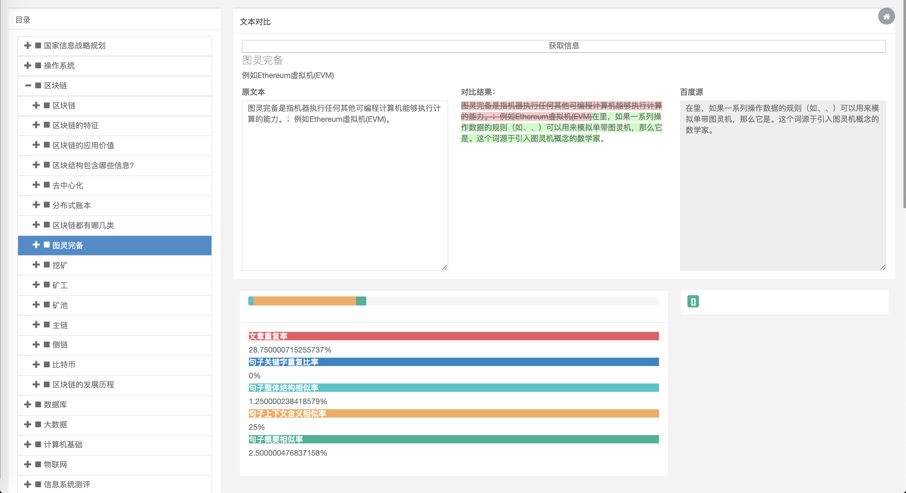

# JLP

## 分区介绍
* 左侧是数据库中所有的数据（动态从数据库中读取）
* 右侧是从百度百科爬取到的数据以及本地的数据对比情况。
* 标题下是关于"名词"的解释的概要。
* 最下面的重复率的比较情况。
## 技术介绍
* 数据持久层采用Hibernate框架，使用了MySQL数据库。
* 前端纯Html页面，采用ajax异步传输，代码清晰，逻辑清楚。
* 依赖方面完全使用maven，方便打包。
## 版本信息
* JDK 8
* Tomcat 8.5
## 其他信息
* 采取HanLp进行分词处理的时候使用到了模型，因为模型太大无法上传，如果需需要请到HanLp官方首页下载。（置于src/resources/data中）
* Hibernate以及log4j的配置均在src/resources/中
* 数据表结构位于src/resources/data_bk.sql